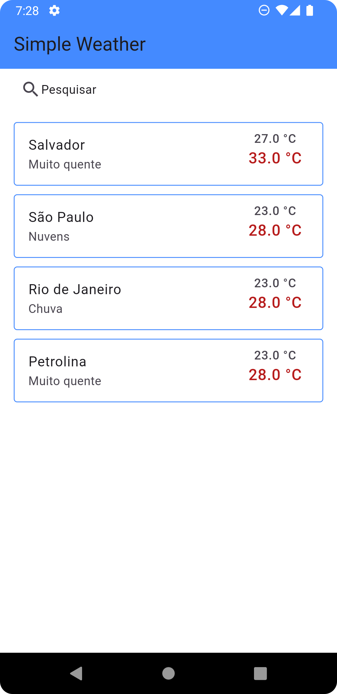

# Simple Weather

O projeto consiste em um software a ser desenvolvido ao longo do segundo semestre de 2024 para a
disciplina de Tópicos em Engenharia de Software. Será um aplicativo que permitirá ao usuário **pesquisar por
informações climáticas** de cidades, podendo também armazenar ou remover cidades de um histórico armazenado
internamente no dispositivo e tendo acesso a informações relacionadas às estimativas climáticas para os próximos
dias. O objetivo é que o aplicativo seja o mais **simples e prático** possível para um usuário comum, escapando de
informações que muitas vezes não são relevantes para grande parte dos usuários.

### Discentes

- Amanda Bandeira Aragão Rigaud Lima
- Felipe Azevedo Ribeiro
- Guilherme Heriques Almeida

### Docente

- Sergio Martins Fernandes

